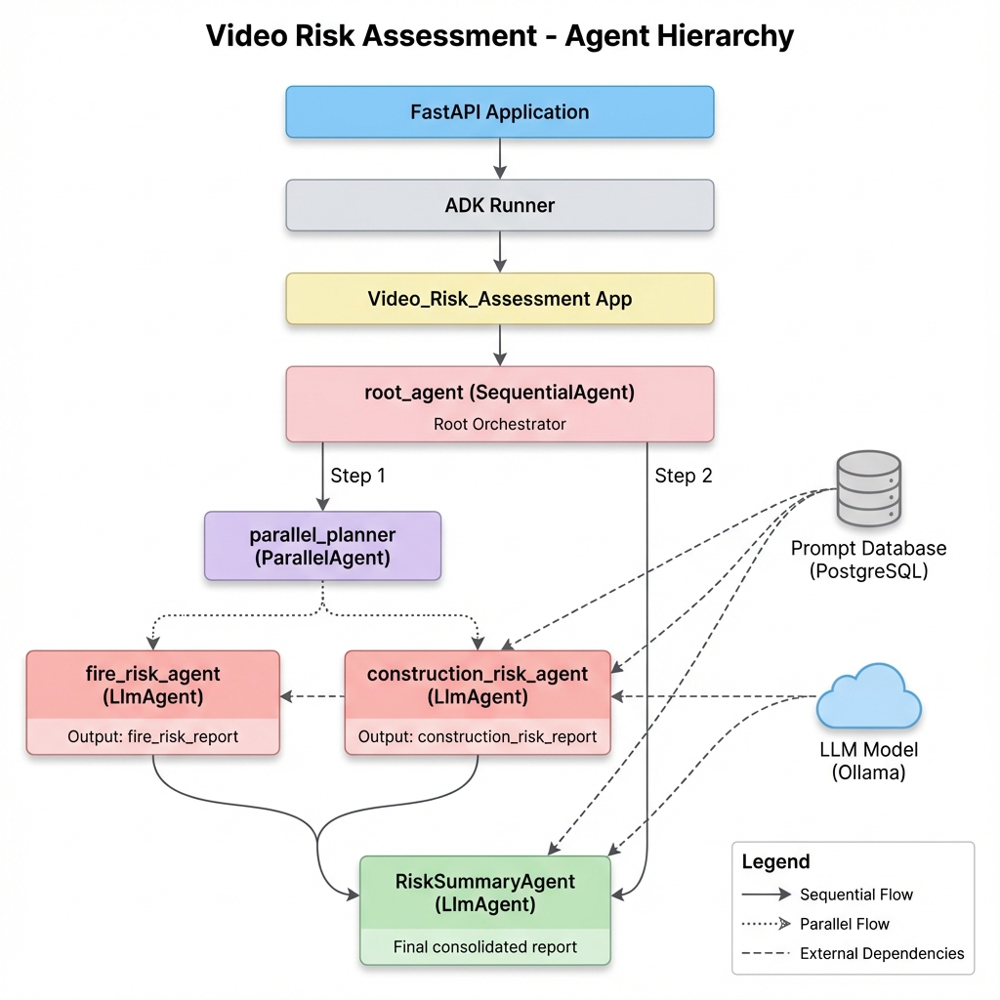
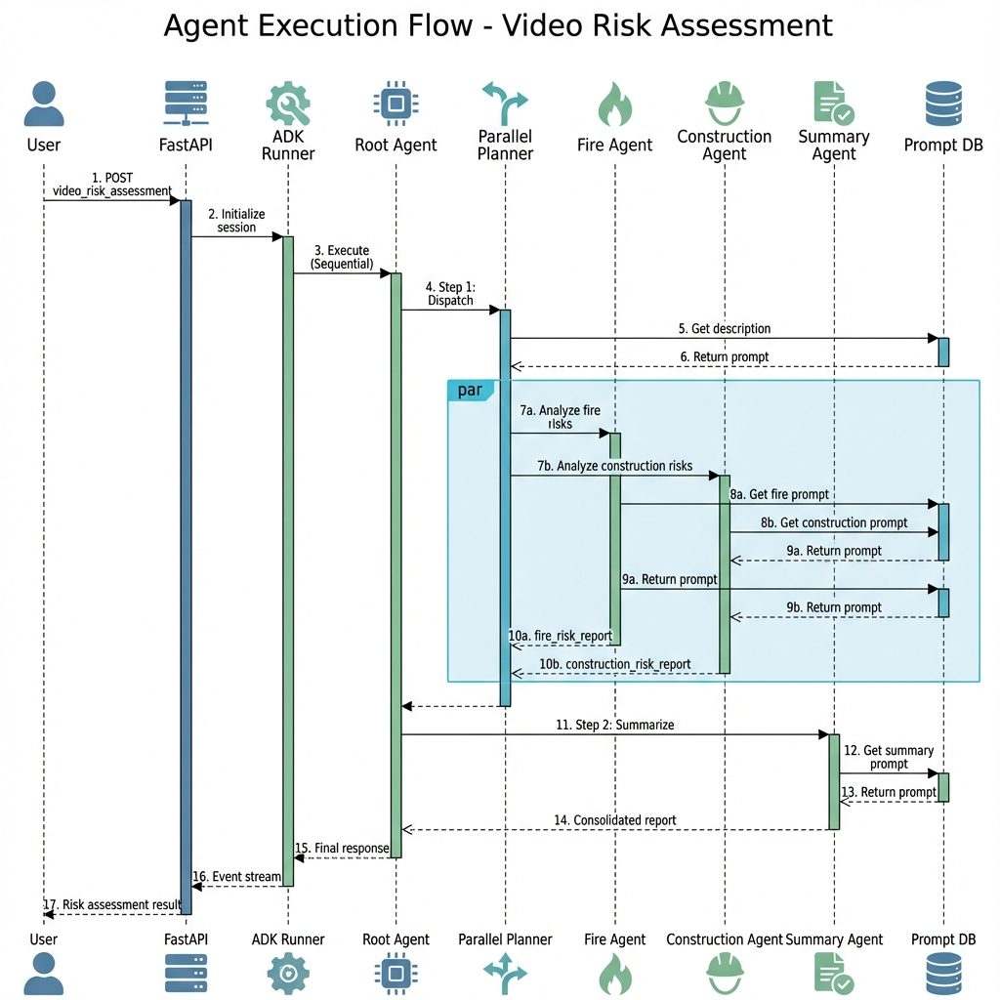
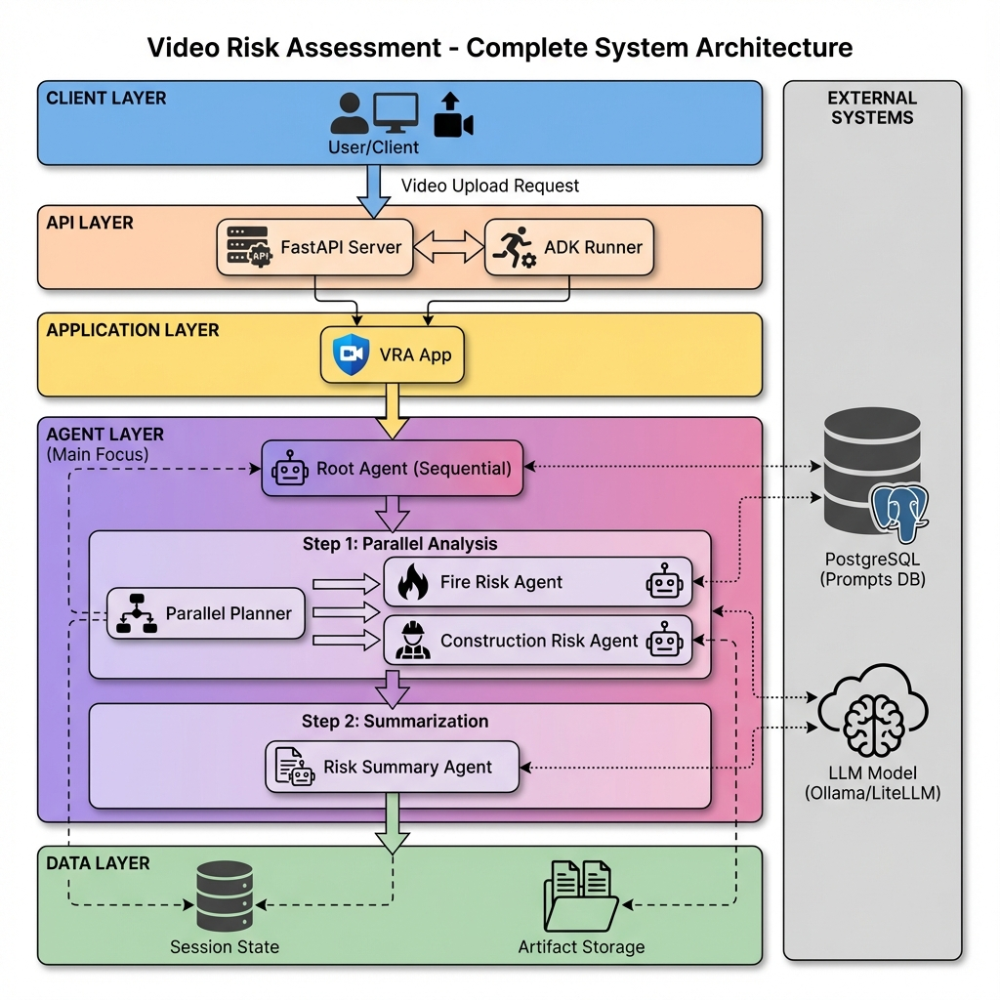
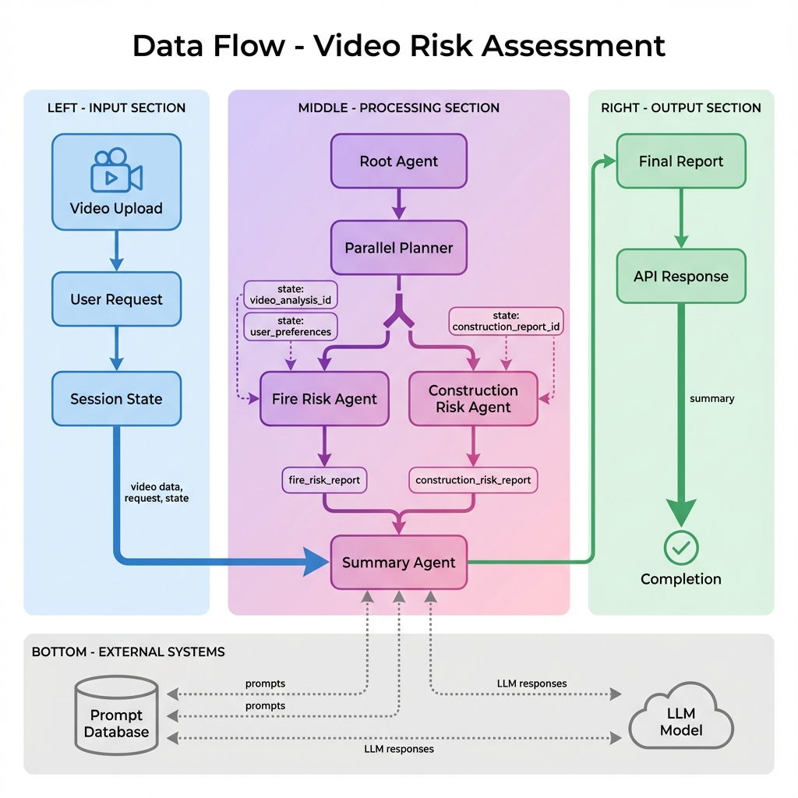

# Agent Architecture Diagrams

This directory contains visual diagrams of the Video Risk Assessment multi-agent system architecture.

## Available Diagrams

### 1. Agent Hierarchy Diagram
**File:** `agent_hierarchy_diagram.png`

Shows the complete agent hierarchy from FastAPI application down to individual LLM agents, including:
- Root agent (Sequential)
- Parallel planner
- Fire risk agent
- Construction risk agent
- Risk summary agent
- External dependencies (Prompt Database, LLM Model)

---

### 2. Agent Sequence Flow
**File:** `agent_sequence_flow.png`

Detailed sequence diagram showing the complete execution flow of a video risk assessment request, including:
- User interaction
- API layer processing
- Agent orchestration
- Parallel execution
- Database interactions
- Final response generation

---

### 3. System Architecture Diagram
**File:** `system_architecture_diagram.png`

Comprehensive system architecture showing all layers:
- Client layer
- API layer (FastAPI, ADK Runner)
- Application layer
- Agent layer (with all agents)
- Data layer (Session State, Artifact Storage)
- External systems (PostgreSQL, LLM Model)

---

### 4. Data Flow Diagram
**File:** `data_flow_diagram.png`

Illustrates how data flows through the system:
- Input section (video upload, user request)
- Processing section (parallel agent execution)
- Output section (final report, API response)
- External dependencies and state management

---

## Usage

These diagrams can be used for:
- **Documentation** - Include in technical documentation or presentations
- **Onboarding** - Help new team members understand the architecture
- **Design Reviews** - Reference during architecture discussions
- **Troubleshooting** - Visualize the flow when debugging issues

## Additional Resources

For more detailed information, see:
- **AGENT_ARCHITECTURE.md** - Complete architecture documentation with Mermaid diagrams
- **AGENT_DIAGRAMS_QUICK_REF.md** - Quick reference with ASCII diagrams and tables
- **API_DOCUMENTATION.md** - REST API endpoint documentation
- **IMPLEMENTATION_SUMMARY.md** - Implementation details and features

---

## Diagram Descriptions

### Agent Types Used
- **SequentialAgent**: Executes sub-agents in order (root_agent)
- **ParallelAgent**: Executes sub-agents simultaneously (parallel_planner)
- **LlmAgent**: Uses LLM for processing (fire_risk, construction_risk, summary agents)

### Execution Pattern
1. **User uploads video** → FastAPI endpoint
2. **Sequential execution** begins at root_agent
3. **Parallel analysis** - Fire and Construction agents run simultaneously
4. **Sequential summarization** - Summary agent aggregates results
5. **Response returned** to user

### Key Features Illustrated
- ✅ Multi-agent orchestration
- ✅ Parallel processing for efficiency
- ✅ Dynamic prompt loading from database
- ✅ State management across agents
- ✅ External system integration (DB, LLM)

---

**Generated:** 2025-11-28  
**Project:** Video Risk Assessment (VRA)  
**Framework:** Google ADK
